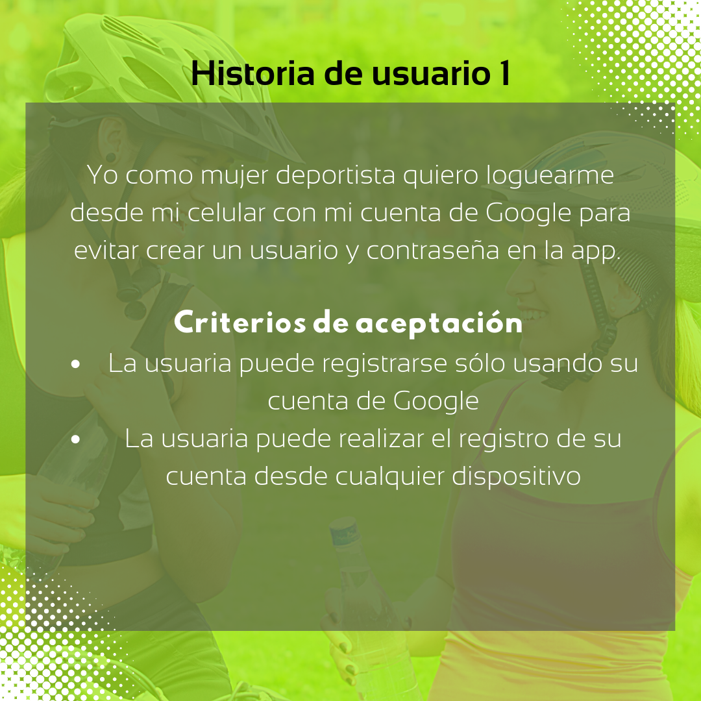

# Red social Sport  Fem 

## 1. Resumen del proyecto
Sport Fem es una red social que conecta a mujeres que suelen realizar deportes al aire libre y buscan crear comunidad con otras mujeres, organizar salidas deportivas, compartir tips y sus logros en esta red social. Mujeres de todas partes pueden conectar y organizar trekings,paseos en bicicleta,yoga en un parque, una mañana de natación o la actividad que ellas prefieran, señalando la ubicación, fecha del evento y nivel de dificultad. 

La inspiración de este proyecto fue la necesidad de crear espacios seguros para fomentar el deporte al aire libre como una herramienta para mejorar la calidad de vida y salud en las mujeres. 

## 2. Planificación y prototipo digital
Para determinar la temática de la red social y detalles de su contenido se realizaron dos encuestas online dirigidas a nuestro público objetivo. A partir de los resultados obtenidos se testearon los prototipos priorizando la versión mobile de la app y se consideró el feedback para mejorar el diseño. 

* [Encuesta aquí](https://forms.gle/MMZ9xvSHtxJPCGB98)

### Prototipo digital

## 3. Historias de usuario

### Definición de terminado
* Conectar la app con firebase para permitir el logeo con google 
* Conectar la app con firestore para almacenar los datos y mostrar post
* Diseñar la app con la metodología de mobile first y que sea responsive a multiples dispositivos
* La red social es un single page application

## 4. Interfaz de usuario
Para utilizar la red social la usuaria debe realizar los siguientes pasos:
* Ingresar a través del registro con Google o mediante el ingreso con usuario y contraseña. Si es primera vez que ingresa debe registrarse previamente. 
* Ver los post en el muro
* Escribir y publicar un post propio 
* Eliminar una publicación 
* Ingresar a su perfil 
* Cerrar sesión

## 5. Test de usabilidad

Se realizaron distintos testeos de la aplicación al grupo objetivo para probar su usabilidad y diseño intuitivo, a partir del feedback se realizaron las siguientes modificaciones:

* Se cambiaron los colores del logo y botones por unos más vibrantes
* Se reemplazaron los diseños de íconos por los que resultaron más intuitivos para el usuario
* Se le dió colores contrastantes a los botones para resaltarlos
* Se cambió la imagen de fondo en el login de la versión desktop

## 6. Link a la app

## 7. Creado por

Yusjuanis Hernández - Camila Olivares - Constanza Ramos